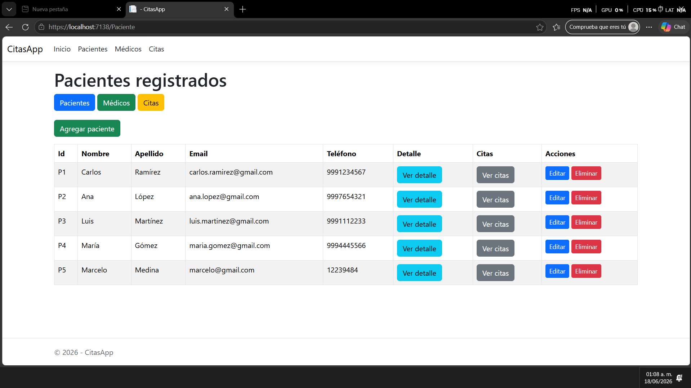
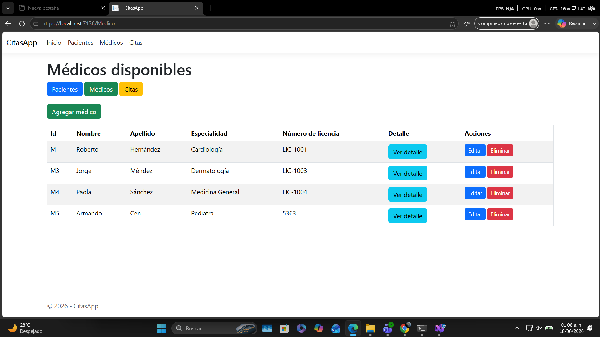

# CitasApp

## Descripción del proyecto

CitasApp es una aplicación web desarrollada con ASP.NET Core MVC que permite gestionar pacientes, médicos y citas médicas.

El proyecto fue reorganizado desde una estructura MVC tradicional hacia una arquitectura hexagonal separada en cuatro capas: `CitasApp.Domain`, `CitasApp.Application`, `CitasApp.Infrastructure` y `CitasApp.Web`.

La aplicación conserva las funcionalidades del proyecto MVC: crear, visualizar, editar y eliminar pacientes, médicos y citas. También mantiene persistencia mediante archivos JSON, agrega repositorios como adaptadores de infraestructura y mueve la lógica de uso de la aplicación a servicios en la capa Application.

## Funcionalidades principales

* Visualización de pacientes registrados.
* Visualización del detalle de un paciente.
* Registro de nuevos pacientes.
* Edición de pacientes existentes.
* Eliminación de pacientes.
* Visualización de médicos disponibles.
* Visualización del detalle de un médico.
* Registro de nuevos médicos.
* Edición de médicos existentes.
* Eliminación de médicos.
* Visualización de la agenda completa de citas.
* Creación de nuevas citas médicas.
* Edición de citas médicas existentes.
* Eliminación de citas médicas.
* Filtrado de citas por paciente.
* Persistencia de datos mediante archivos JSON.
* Uso de interfaces en Domain como puertos del dominio.
* Uso de servicios en Application para coordinar las operaciones de la aplicación.
* Uso de repositorios como adaptadores de infraestructura.
* Navegación mediante navbar para evitar escribir rutas manualmente.

## Arquitectura del proyecto

La solución está dividida en cinco proyectos:

```txt
CitasApp
│
├── CitasApp.Domain
│
├── CitasApp.Application
│
├── CitasApp.Infrastructure
│
├── CitasApp.Web
│
└── CitasApp.Api
```

## Capas de la arquitectura

### CitasApp.Domain

Contiene los modelos principales del sistema y las interfaces de repositorio. Esta capa representa el núcleo del dominio y no depende de las demás capas.

```txt
CitasApp.Domain
├── Models
│   ├── Paciente.cs
│   ├── Medico.cs
│   └── Cita.cs
│
└── Interfaces
    ├── IRepository.cs
    ├── IPacienteRepository.cs
    ├── IMedicoRepository.cs
    └── ICitaRepository.cs
```

### CitasApp.Application

Contiene los servicios de aplicación. Estos servicios usan las interfaces definidas en `CitasApp.Domain` para coordinar las operaciones de pacientes, médicos y citas sin depender de implementaciones concretas de infraestructura.

```txt
CitasApp.Application
└── Services
    ├── PacienteService.cs
    ├── MedicoService.cs
    └── CitaService.cs
```

### CitasApp.Infrastructure

Contiene los adaptadores concretos de persistencia. En esta capa están los repositorios que implementan las interfaces definidas en `CitasApp.Domain`.

```txt
CitasApp.Infrastructure
└── Repositories
    ├── JsonRepository.cs
    ├── JsonPacienteRepository.cs
    ├── JsonMedicoRepository.cs
    ├── JsonCitaRepository.cs
    └── MemoriaPacienteRepository.cs
```

`JsonPacienteRepository` usa archivos JSON para guardar pacientes.

`MemoriaPacienteRepository` implementa la misma interfaz `IPacienteRepository`, pero guarda los datos en memoria. Esto permite cambiar el adaptador registrado sin modificar el dominio ni los controladores.

### CitasApp.Web

Contiene la aplicación ASP.NET Core MVC: controladores, vistas, archivos estáticos, configuración y archivos JSON de datos.

```txt
CitasApp.Web
├── Controllers
│   ├── PacienteController.cs
│   ├── MedicoController.cs
│   ├── CitaController.cs
│   └── HomeController.cs
│
├── Views
│   ├── Paciente
│   ├── Medico
│   ├── Cita
│   ├── Home
│   └── Shared
│
├── Data
│   ├── pacientes.json
│   ├── medicos.json
│   └── citas.json
│
├── Models
│   └── ErrorViewModel.cs
│
├── wwwroot
├── Program.cs
└── appsettings.json
```


### CitasApp.Api

Contiene una API REST como adaptador de entrada adicional. Esta capa permite que otros clientes, como una aplicación móvil, consuman datos de la agenda médica sin depender de las vistas MVC.

```txt
CitasApp.Api
├── Controllers
│   ├── AgendaMedicoController.cs
│   └── RecordatoriosController.cs
│
├── Dtos
│   ├── AgendaMedicoDto.cs
│   ├── RecordatorioWhatsappDto.cs
│   └── EnviarWhatsappResponseDto.cs
│
├── Program.cs
└── appsettings.json
```

Endpoints principales de agenda médica:

```txt
GET /api/medicos/{medicoId}/agenda
GET /api/medicos/{medicoId}/agenda/hoy
GET /api/medicos/{medicoId}/agenda/fecha/{fecha}
```

Ejemplos:

```txt
GET /api/medicos/M1/agenda
GET /api/medicos/M1/agenda/hoy
GET /api/medicos/M1/agenda/fecha/2026-06-10
```

Endpoints principales de recordatorios por WhatsApp:

```txt
GET /api/recordatorios/pendientes?dias=1
POST /api/recordatorios/whatsapp/{citaId}
```

Ejemplos:

```txt
GET /api/recordatorios/pendientes?dias=7
POST /api/recordatorios/whatsapp/C1
```

El envío por WhatsApp queda simulado. El endpoint genera el mensaje y una URL de WhatsApp (`wa.me`). Para envío real se debe integrar un proveedor externo como Meta WhatsApp Cloud API o Twilio.

## Referencias entre proyectos

```txt
CitasApp.Web → CitasApp.Application
CitasApp.Web → CitasApp.Infrastructure
CitasApp.Web → CitasApp.Domain

CitasApp.Api → CitasApp.Application
CitasApp.Api → CitasApp.Infrastructure
CitasApp.Api → CitasApp.Domain

CitasApp.Infrastructure → CitasApp.Domain

CitasApp.Application → CitasApp.Domain

CitasApp.Domain → sin dependencias externas del proyecto
```

## Cambio de adaptador

En `CitasApp.Web/Program.cs` se registra qué implementación se usará para `IPacienteRepository`.

Por defecto se usa el adaptador JSON:

```csharp
var usarPacientesEnMemoria = false;
```

Para probar el segundo adaptador en memoria, se puede cambiar a:

```csharp
var usarPacientesEnMemoria = true;
```

Esto cambia la implementación usada por la aplicación sin modificar `CitasApp.Domain`, `CitasApp.Application` ni los controladores MVC.

## Persistencia de datos

La persistencia JSON se guarda en la carpeta `Data` dentro del proyecto web:

```txt
CitasApp.Web/Data/pacientes.json
CitasApp.Web/Data/medicos.json
CitasApp.Web/Data/citas.json
```

Los repositorios JSON leen y guardan información en esos archivos. La API también usa esos archivos para consultar la misma información que administra la aplicación MVC.

## Capturas de pantalla de la app corriendo

### Pantalla de pacientes



### Pantalla de médicos



### Pantalla de citas


### Formulario para crear cita


## Cómo ejecutar el proyecto MVC

Desde la raíz de la solución:

```bash
dotnet run --project CitasApp.Web
```

También se puede abrir la solución en Visual Studio y ejecutar el proyecto `CitasApp.Web`.

## Cómo ejecutar la API REST

Desde la raíz de la solución:

```bash
dotnet run --project CitasApp.Api
```

La API usa los puertos y servicios existentes de la arquitectura hexagonal, pero expone respuestas JSON para clientes externos.

## Nota sobre uso de IA

Durante el desarrollo de este proyecto se utilizó apoyo de inteligencia artificial como herramienta de asistencia para estructurar ideas, revisar código, implementar mejoras, migrar a arquitectura hexagonal, agregar una API REST y resolver errores.
