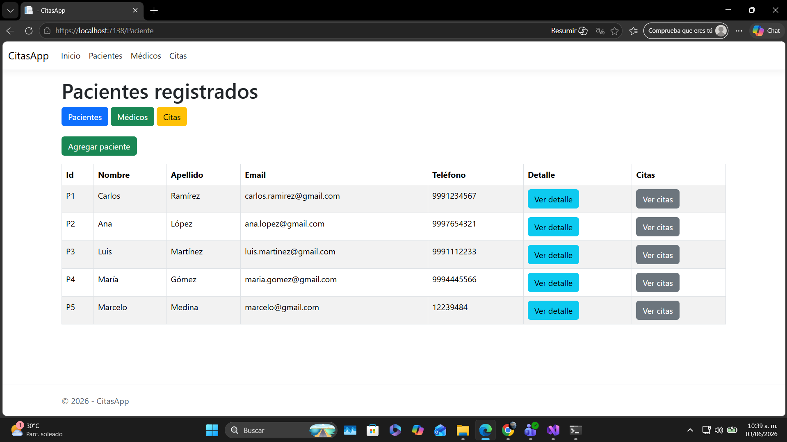
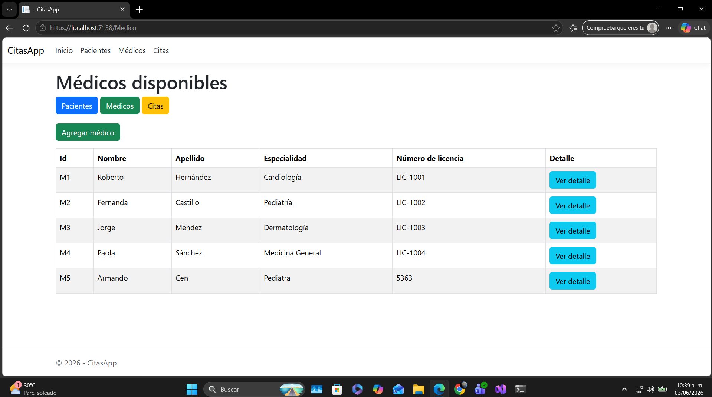
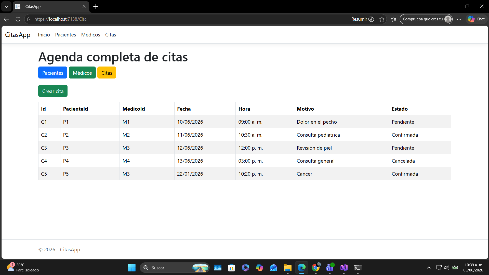
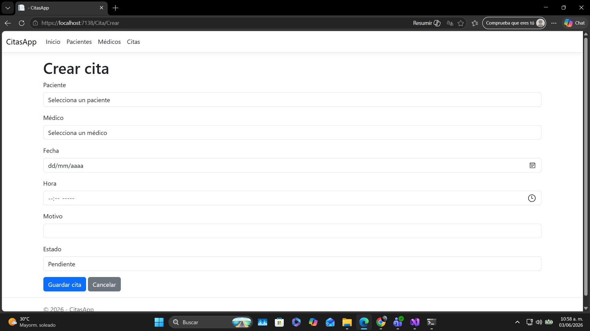

# CitasApp

## Descripción del proyecto

CitasApp es una aplicación web desarrollada con ASP.NET Core MVC que permite gestionar información básica de pacientes, médicos y citas médicas.

El sistema permite visualizar listas de pacientes, médicos y citas, consultar detalles individuales y registrar nueva información mediante formularios. Además, la aplicación cuenta con persistencia de datos usando archivos JSON, por lo que la información registrada se mantiene guardada aunque se cierre o reinicie el proyecto.

## Funcionalidades principales

* Visualización de pacientes registrados.
* Visualización del detalle de un paciente.
* Registro de nuevos pacientes.
* Visualización de médicos disponibles.
* Visualización del detalle de un médico.
* Registro de nuevos médicos.
* Visualización de la agenda completa de citas.
* Creación de nuevas citas médicas.
* Filtrado de citas por paciente.
* Persistencia de datos mediante archivos JSON.
* Navegación mediante navbar para evitar escribir rutas manualmente.

## Tecnologías usadas

* C#
* ASP.NET Core MVC
* Razor Views
* HTML
* CSS
* Bootstrap
* JSON
* Git
* GitHub
* Visual Studio

## Estructura del proyecto

```txt
CitasApp
│
├── Controllers
│   ├── PacienteController.cs
│   ├── MedicoController.cs
│   └── CitaController.cs
│
├── Models
│   ├── Paciente.cs
│   ├── Medico.cs
│   └── Cita.cs
│
├── Views
│   ├── Paciente
│   ├── Medico
│   ├── Cita
│   └── Shared
│
├── Services
│   └── JsonFileService.cs
│
├── Data
│   ├── pacientes.json
│   ├── medicos.json
│   └── citas.json
│
├── wwwroot
├── Program.cs
└── README.md
```

## Persistencia de datos

La aplicación guarda la información en archivos JSON ubicados dentro de la carpeta `Data`.

Los archivos utilizados son:

```txt
Data/pacientes.json
Data/medicos.json
Data/citas.json
```

La clase `JsonFileService.cs` se encarga de leer y guardar los datos en estos archivos, permitiendo que la información se conserve después de cerrar la aplicación.

## Capturas de pantalla de la app corriendo

### Pantalla de pacientes



### Pantalla de médicos



### Pantalla de citas



### Formulario para crear cita



## Cómo ejecutar el proyecto

1. Abrir el proyecto en Visual Studio.
2. Ejecutar la aplicación con HTTPS.
3. Usar la barra de navegación para acceder a:

   * Pacientes
   * Médicos
   * Citas

## Nota sobre uso de IA

Durante el desarrollo de este proyecto se utilizó apoyo de inteligencia artificial como herramienta de asistencia para estructurar ideas, revisar código y resolver errores. 
