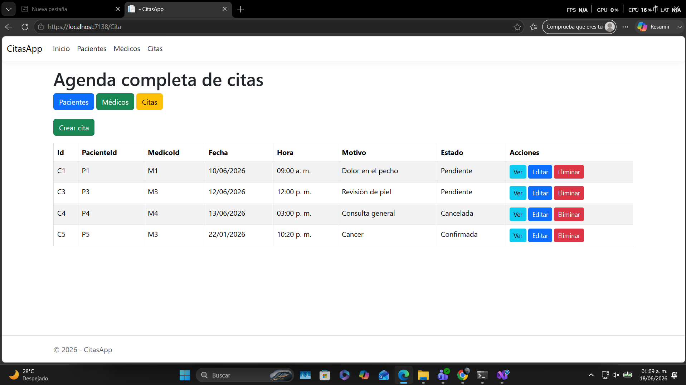
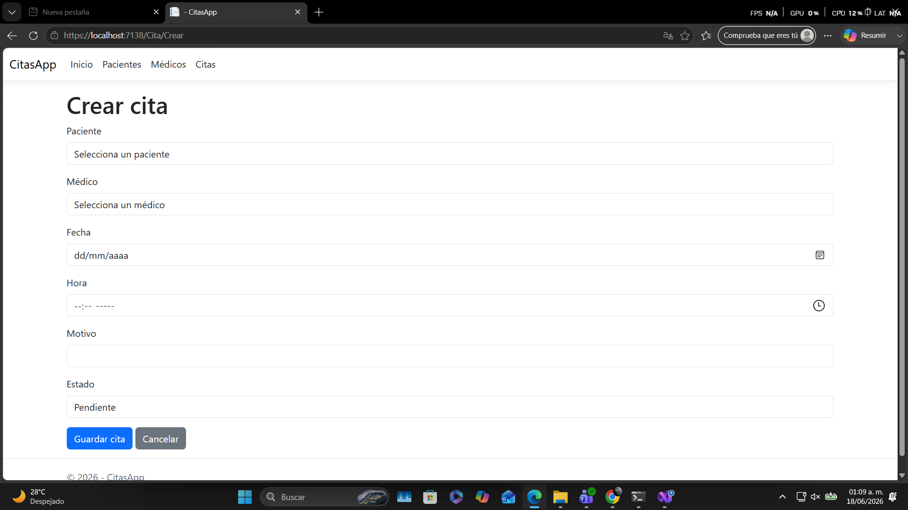

# CitasApp

## Descripción del proyecto

CitasApp es una aplicación web desarrollada con ASP.NET Core MVC que permite gestionar información básica de pacientes, médicos y citas médicas.

El sistema permite registrar, visualizar, editar y eliminar pacientes, médicos y citas. Además, cuenta con persistencia de datos mediante archivos JSON, por lo que la información registrada se mantiene guardada aunque se cierre o reinicie el proyecto.

La aplicación utiliza una arquitectura MVC y ahora incorpora interfaces en la capa de servicios para mejorar la organización del código, reducir el acoplamiento y facilitar futuras mejoras o cambios en la forma de persistir los datos.

## Funcionalidades principales

* Visualización de pacientes registrados.
* Visualización del detalle de un paciente.
* Registro de nuevos pacientes.
* Edición de pacientes existentes.
* Eliminación de pacientes.
* Visualización de médicos disponibles.
* Visualización del detalle de un médico.
* Registro de nuevos médicos.
* Edición de médicos existentes.
* Eliminación de médicos.
* Visualización de la agenda completa de citas.
* Creación de nuevas citas médicas.
* Edición de citas médicas existentes.
* Eliminación de citas médicas.
* Filtrado de citas por paciente.
* Persistencia de datos mediante archivos JSON.
* Uso de interfaces para los servicios de acceso a datos.
* Inyección de dependencias para acceder a los servicios desde los controladores.
* Navegación mediante navbar para evitar escribir rutas manualmente.

## Tecnologías usadas

* C#
* ASP.NET Core MVC
* Razor Views
* HTML
* CSS
* Bootstrap
* JSON
* Git
* GitHub
* Visual Studio

## Estructura del proyecto

```txt
CitasApp
│
├── Controllers
│   ├── PacienteController.cs
│   ├── MedicoController.cs
│   └── CitaController.cs
│
├── Models
│   ├── Paciente.cs
│   ├── Medico.cs
│   └── Cita.cs
│
├── Views
│   ├── Paciente
│   │   ├── Index.cshtml
│   │   ├── Detalles.cshtml
│   │   ├── Crear.cshtml
│   │   └── Editar.cshtml
│   │
│   ├── Medico
│   │   ├── Index.cshtml
│   │   ├── Detalles.cshtml
│   │   ├── Crear.cshtml
│   │   └── Editar.cshtml
│   │
│   ├── Cita
│   │   ├── Index.cshtml
│   │   ├── Detalles.cshtml
│   │   ├── Crear.cshtml
│   │   └── Editar.cshtml
│   │
│   └── Shared
│
├── Services
│   ├── IJsonFileService.cs
│   └── JsonFileService.cs
│
├── Data
│   ├── pacientes.json
│   ├── medicos.json
│   └── citas.json
│
├── wwwroot
├── Program.cs
└── README.md
```

## Persistencia de datos

La aplicación guarda la información en archivos JSON ubicados dentro de la carpeta `Data`.

Los archivos utilizados son:

```txt
Data/pacientes.json
Data/medicos.json
Data/citas.json
```

La clase `JsonFileService.cs` se encarga de leer y guardar los datos en estos archivos. Esta clase implementa la interfaz `IJsonFileService<T>`, lo que permite que los controladores dependan de una abstracción y no directamente de una clase concreta.

Esto mejora la organización del proyecto y facilita que en el futuro se pueda cambiar la forma de almacenamiento, por ejemplo, reemplazando los archivos JSON por una base de datos.

## Uso de interfaces e inyección de dependencias

El proyecto incorpora la interfaz `IJsonFileService<T>` para definir las operaciones necesarias de lectura y escritura de datos.

El servicio concreto `JsonFileService<T>` implementa esta interfaz y es registrado en `Program.cs` mediante inyección de dependencias.

De esta forma, los controladores reciben los servicios necesarios a través del constructor, evitando crear instancias directamente dentro de cada controlador.

Ejemplo general:

```csharp
private readonly IJsonFileService<Paciente> _pacienteService;
```

Esto permite que el código sea más mantenible, reutilizable y fácil de modificar.

## Operaciones CRUD

La aplicación permite realizar operaciones CRUD sobre las entidades principales del sistema.

### Pacientes

* Crear pacientes.
* Ver listado de pacientes.
* Ver detalles de un paciente.
* Editar información de un paciente.
* Eliminar pacientes.

### Médicos

* Crear médicos.
* Ver listado de médicos.
* Ver detalles de un médico.
* Editar información de un médico.
* Eliminar médicos.

### Citas

* Crear citas médicas.
* Ver listado de citas.
* Ver detalles de una cita.
* Editar información de una cita.
* Eliminar citas.
* Filtrar citas por paciente.

## Capturas de pantalla de la app corriendo

### Pantalla de pacientes


### Pantalla de médicos


### Pantalla de citas



### Formulario para crear cita



## Cómo ejecutar el proyecto

1. Clonar o descargar el repositorio.
2. Abrir el proyecto en Visual Studio o Visual Studio Code.
3. Verificar que se está trabajando en la rama `main`.
4. Ejecutar la aplicación.

Desde terminal:

```bash
dotnet run
```

También se puede ejecutar desde Visual Studio usando el botón de inicio con HTTPS.

## Navegación de la aplicación

La aplicación cuenta con una barra de navegación que permite acceder fácilmente a las secciones principales:

* Pacientes
* Médicos
* Citas

Desde cada sección se pueden realizar las acciones disponibles, como crear, ver detalles, editar o eliminar registros.

## Nota sobre uso de IA

Durante el desarrollo de este proyecto se utilizó apoyo de inteligencia artificial como herramienta de asistencia para estructurar ideas, revisar código, implementar mejoras, agregar interfaces, completar funcionalidades CRUD y resolver errores.

