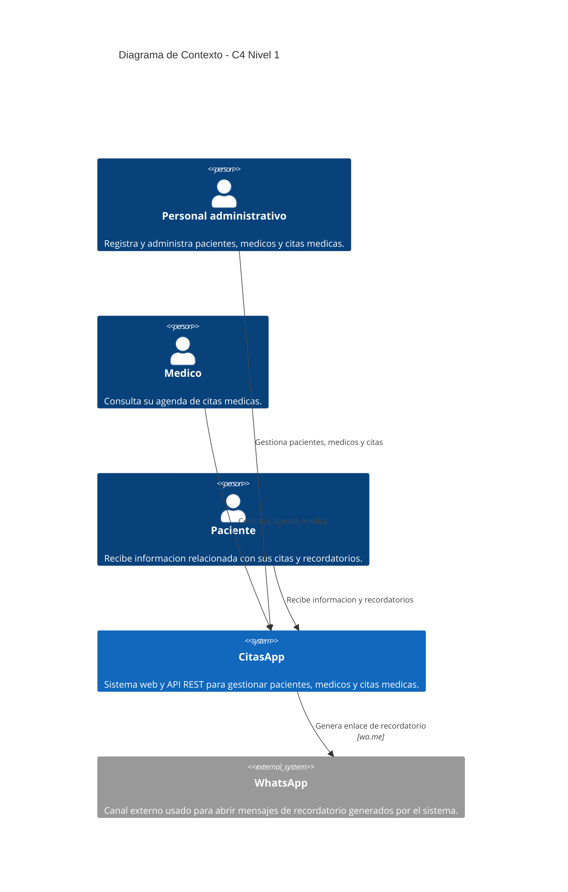

# Arquitectura C4 del Proyecto

## Descripción del proyecto

CitasApp es un sistema desarrollado con ASP.NET Core para gestionar pacientes, médicos y citas médicas. El proyecto incluye una aplicación web MVC para administrar la información y una API REST para consultar agendas médicas, revisar recordatorios pendientes y generar enlaces simulados de recordatorio por WhatsApp.

El sistema ayuda a organizar la atención médica básica, centralizando el registro de pacientes, médicos y citas en archivos JSON usados como mecanismo simple de persistencia.

## C4 Nivel 1 — Contexto

### ¿Para quién es este nivel?

Este nivel está dirigido a personas que necesitan entender el sistema de forma general, como usuarios, profesores, clientes, compañeros de equipo o evaluadores técnicos. No requiere conocer detalles internos de programación.

### ¿Qué pregunta responde?

Responde la pregunta: ¿qué es el sistema, quién lo usa y con qué sistemas externos se comunica?

